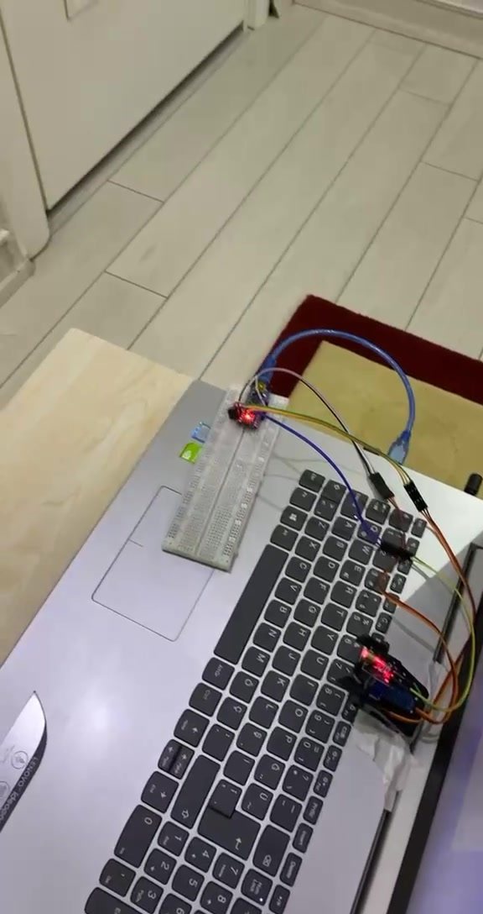
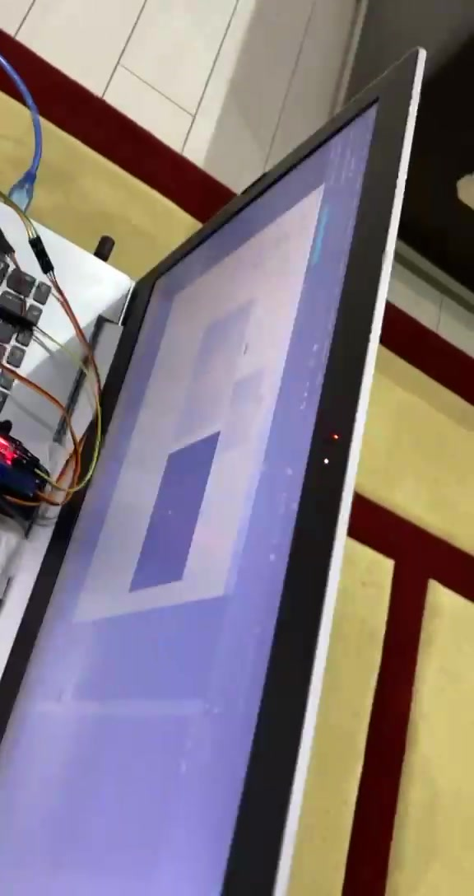
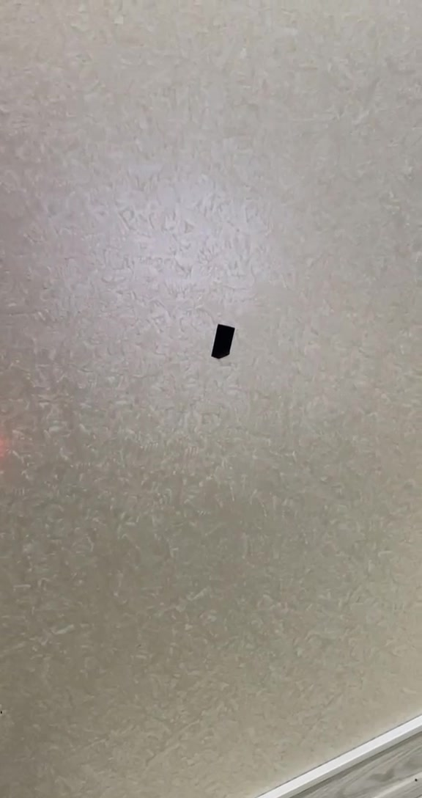
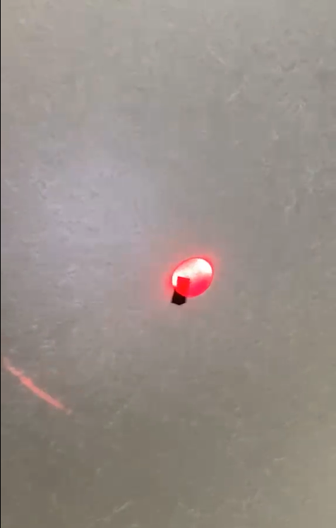

# Robotic Arm with Laser Targeting

A robotic arm that carries a laser pointer and uses a laptop camera to find a marked target on a wall, then moves until the laser lands on it.

Built as a university project in Computer Engineering at Uskudar University, Istanbul.

---

## Demo

**[Watch the demo video](media/robotic-arm-demo.mp4)**

   
  <em>Arduino and breadboard wired to the laptop over USB</em>

   
  <em>The desktop application processing the camera feed</em>

   
  <em>The target, marked with black tape</em>

   
  <em>The arm moving the laser onto the target point</em>

---

## How it works

1. **Vision** — the laptop camera captures a live feed of the wall.
2. **Detection** — a C# application processes each frame to find the dark target marker and calculate its position within the image.
3. **Translation** — the offset between the target's position and the laser's current position is converted into the angles the arm needs to move through.
4. **Motion** — those angles are sent over serial to the Arduino, which drives the servo and stepper motors carrying the laser.
5. **Correction** — the loop repeats, so the arm keeps adjusting until the laser is on target, and re-adjusts if the target moves.

---

## Hardware

- Arduino microcontroller, mounted on a breadboard
- Servo motors and plastic stepper motors for arm articulation
- Laser pointer mounted on the arm
- Laptop camera as the vision sensor
- Target marked with black tape on the wall
- Custom-built arm frame

## Software

- **C#** — desktop application handling image processing and control logic
- **Arduino C** — firmware receiving commands and driving the motors
- Serial communication between the two over USB

---

## A note on the source code

The original source code is not in this repository. It was written during my degree in Istanbul and lost during a hardware change before this repository existed. The base implementation was provided by my professor as part of the coursework; my work was adapting and rewriting it to run correctly on my own hardware, including calibrating for my laptop's camera and the specific motors in my build.

I have chosen to document the project honestly rather than publish code I cannot verify. This repository contains the demonstration video, stills taken from it, and a full technical description of how the system worked.

A simplified reconstruction of the control loop is planned. When added, it will be clearly marked as a reconstruction rather than the original.

---

## What I learned

- **Debugging across boundaries.** When the arm did not move correctly, the cause could be the detection code, the serial communication, the Arduino firmware, the wiring, the power supply, or a mechanical limit. There is no way through that except eliminating possibilities one at a time, in order.
- **Real-time systems behave differently.** Code that works fine when run once can fail in a control loop, because timing and consistency suddenly matter.
- **Hardware does not respect assumptions.** Servos overshoot, cameras see different lighting than your eyes do, and the physical build introduces tolerances that no amount of correct code compensates for.
- **Calibration is most of the work.** Getting from "it moves" to "it moves to the right place" took far longer than getting it to move at all.

---

## What I would do differently now

- Use version control from day one, so this repository would not need the note above
- Build a calibration routine instead of hardcoding values tuned to one specific setup
- Log the detection output to a file, so failures could be diagnosed afterwards rather than only while watching it run

---

## Author

**Obinna Cyril Igboechi** 
Computer Engineering graduate, based in Portugal 
[LinkedIn](https://www.linkedin.com/in/obinna-cyril/) · [GitHub](https://github.com/obinna-c-igboechi)
